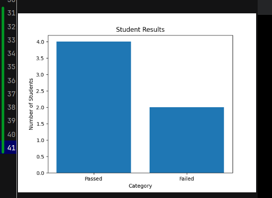

# Student Grade Analyzer

This is a simple Python project that reads student data from a CSV file and performs basic analysis.

## Features
- Calculates average grade
- Finds highest and lowest grades
- Counts passed and failed students

## Technologies
- Python
- CSV file handling

## How to run

```bash
python analyzer.py
```

## Sample Output


## Description
This project analyzes student grades from a CSV file, calculates key statistics, and visualizes results using Python and Matplotlib.

## Author
YagmurBad
